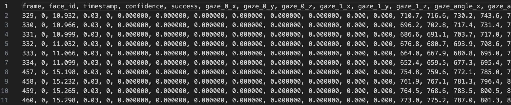

# 准备docker
确保运行环境有docker 并且启动；
# 部署OpenFace
使用docker 部署 OpenFace(https://github.com/TadasBaltrusaitis/OpenFace/wiki)
```bash
$ docker run -it --rm algebr/openface:latest
```
正常拉取镜像安装的话，执行 `docker images` 输出如下
```
docker images
REPOSITORY        TAG       IMAGE ID       CREATED       SIZE
algebr/openface   latest    897d82cd4a3a   6 years ago   8.11GB
```

执行`docker ps` 能看见启动的容器
```
docker ps
CONTAINER ID   IMAGE                    COMMAND       CREATED          STATUS          PORTS     NAMES
4355dbcb9f33   algebr/openface:latest   "/bin/bash"   15 minutes ago   Up 15 minutes             wizardly_galois
```

# 运行程序
把获取的容器id, 如4355dbcb9f33 ；和主机视频目录路径，输出路径填写到脚本开始
```python
DOCKER_ID = '4355dbcb9f33'
folder = 'video'
output_dir = 'output'
```

正常运行输出：
```bash
python3 feature_extract.py 
Successfully copied 75.5MB to 4355dbcb9f33:/home/openface-build/videos
libdc1394 error: Failed to initialize libdc1394
Could not find the HAAR face detector location
Reading the landmark detector/tracker from: ./build/bin/model/main_ceclm_general.txt
Reading the landmark detector module from: ./build/bin/model/cen_general.txt
Reading the PDM module from: ./build/bin/model/pdms/In-the-wild_aligned_PDM_68.txt....Done
Reading the Triangulations module from: ./build/bin/model/tris_68.txt....Done
Reading the intensity CEN patch experts from: ./build/bin/model/patch_experts/cen_patches_0.25_of.dat....Done
Reading the intensity CEN patch experts from: ./build/bin/model/patch_experts/cen_patches_0.35_of.dat....Done
Reading the intensity CEN patch experts from: ./build/bin/model/patch_experts/cen_patches_0.50_of.dat....Done
Reading the intensity CEN patch experts from: ./build/bin/model/patch_experts/cen_patches_1.00_of.dat....Done
Reading part based module....left_eye_28
Reading the landmark detector/tracker from: ./build/bin/model/model_eye/main_clnf_synth_left.txt
Reading the landmark detector module from: ./build/bin/model/model_eye/clnf_left_synth.txt
Reading the PDM module from: ./build/bin/model/model_eye/pdms/pdm_28_l_eye_3D_closed.txt....Done
Reading the intensity CCNF patch experts from: ./build/bin/model/model_eye/patch_experts/left_ccnf_patches_1.00_synth_lid_.txt....Done
Reading the intensity CCNF patch experts from: ./build/bin/model/model_eye/patch_experts/left_ccnf_patches_1.50_synth_lid_.txt....Done
Could not find the landmark detection model to load
Done
Reading part based module....right_eye_28
Reading the landmark detector/tracker from: ./build/bin/model/model_eye/main_clnf_synth_right.txt
Reading the landmark detector module from: ./build/bin/model/model_eye/clnf_right_synth.txt
Reading the PDM module from: ./build/bin/model/model_eye/pdms/pdm_28_eye_3D_closed.txt....Done
Reading the intensity CCNF patch experts from: ./build/bin/model/model_eye/patch_experts/ccnf_patches_1.00_synth_lid_.txt....Done
Reading the intensity CCNF patch experts from: ./build/bin/model/model_eye/patch_experts/ccnf_patches_1.50_synth_lid_.txt....Done
Could not find the landmark detection model to load
Done
Reading the landmark validation module....Done
Reading the MTCNN face detector from: ./build/bin/model/mtcnn_detector/MTCNN_detector.txt
Reading the PNet module from: ./build/bin/model/mtcnn_detector/PNet.dat
Reading the RNet module from: ./build/bin/model/mtcnn_detector/RNet.dat
Reading the ONet module from: ./build/bin/model/mtcnn_detector/ONet.dat
Reading the AU analysis module from: ./build/bin/AU_predictors/main_static_svms.txt
Reading the AU predictors from: ./build/bin/AU_predictors/AU_all_static.txt... Done
Reading the PDM from: ./build/bin/AU_predictors/In-the-wild_aligned_PDM_68.txt... Done
Reading the triangulation from:./build/bin/AU_predictors/tris_68_full.txt... Done
Attempting to read from file: /home/openface-build/videos/test.mp4
Failed to open the video file at location: /home/openface-build/videos/test.mp4
Error response from daemon: Could not find the file /home/openface-build/output/test.csv in container 4355dbcb9f33
Error response from daemon: Could not find the file /home/openface-build/output/test.hog in container 4355dbcb9f33
JQRL2KMR6N:face_feature bytedance$ python3 feature_extract.py 
Successfully copied 75.5MB to 4355dbcb9f33:/home/openface-build/videos
libdc1394 error: Failed to initialize libdc1394
Could not find the HAAR face detector location
Reading the landmark detector/tracker from: ./build/bin/model/main_ceclm_general.txt
Reading the landmark detector module from: ./build/bin/model/cen_general.txt
Reading the PDM module from: ./build/bin/model/pdms/In-the-wild_aligned_PDM_68.txt....Done
Reading the Triangulations module from: ./build/bin/model/tris_68.txt....Done
Reading the intensity CEN patch experts from: ./build/bin/model/patch_experts/cen_patches_0.25_of.dat....Done
Reading the intensity CEN patch experts from: ./build/bin/model/patch_experts/cen_patches_0.35_of.dat....Done
Reading the intensity CEN patch experts from: ./build/bin/model/patch_experts/cen_patches_0.50_of.dat....Done
Reading the intensity CEN patch experts from: ./build/bin/model/patch_experts/cen_patches_1.00_of.dat....Done
Reading part based module....left_eye_28
Reading the landmark detector/tracker from: ./build/bin/model/model_eye/main_clnf_synth_left.txt
Reading the landmark detector module from: ./build/bin/model/model_eye/clnf_left_synth.txt
Reading the PDM module from: ./build/bin/model/model_eye/pdms/pdm_28_l_eye_3D_closed.txt....Done
Reading the intensity CCNF patch experts from: ./build/bin/model/model_eye/patch_experts/left_ccnf_patches_1.00_synth_lid_.txt....Done
Reading the intensity CCNF patch experts from: ./build/bin/model/model_eye/patch_experts/left_ccnf_patches_1.50_synth_lid_.txt....Done
Could not find the landmark detection model to load
Done
Reading part based module....right_eye_28
Reading the landmark detector/tracker from: ./build/bin/model/model_eye/main_clnf_synth_right.txt
Reading the landmark detector module from: ./build/bin/model/model_eye/clnf_right_synth.txt
Reading the PDM module from: ./build/bin/model/model_eye/pdms/pdm_28_eye_3D_closed.txt....Done
Reading the intensity CCNF patch experts from: ./build/bin/model/model_eye/patch_experts/ccnf_patches_1.00_synth_lid_.txt....Done
Reading the intensity CCNF patch experts from: ./build/bin/model/model_eye/patch_experts/ccnf_patches_1.50_synth_lid_.txt....Done
Could not find the landmark detection model to load
Done
Reading the landmark validation module....Done
Reading the MTCNN face detector from: ./build/bin/model/mtcnn_detector/MTCNN_detector.txt
Reading the PNet module from: ./build/bin/model/mtcnn_detector/PNet.dat
Reading the RNet module from: ./build/bin/model/mtcnn_detector/RNet.dat
Reading the ONet module from: ./build/bin/model/mtcnn_detector/ONet.dat
Reading the AU analysis module from: ./build/bin/AU_predictors/main_static_svms.txt
Reading the AU predictors from: ./build/bin/AU_predictors/AU_all_static.txt... Done
Reading the PDM from: ./build/bin/AU_predictors/In-the-wild_aligned_PDM_68.txt... Done
Reading the triangulation from:./build/bin/AU_predictors/tris_68_full.txt... Done
Attempting to read from file: /home/openface-build/videos/test.mp4
Device or file opened
WARNING: using a AU detection in multiple face mode, it might not be as accurate and is experimental
Starting tracking
0% 10% 20% 30% 40% 50% Face too small for landmark detection
Face too small for landmark detection
Face too small for landmark detection
Face too small for landmark detection
Face too small for landmark detection
60% Face too small for landmark detection
Face too small for landmark detection
70% 80% 90% Closing output recorder
Closing input reader
Closed successfully
mkdir: output/test: File exists
Successfully copied 511kB to /Users/bytedance/Documents/face_feature/output/test
Successfully copied 1.82MB to /Users/bytedance/Documents/face_feature/output/test
```

最终会输出`output/test/test.csv` 为结果
